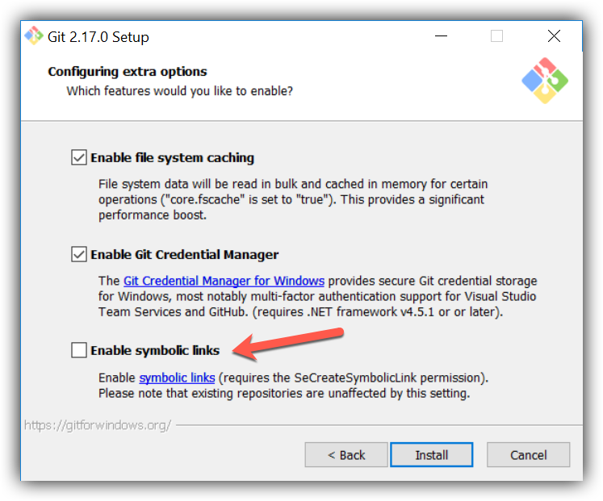

# monodic

多项目单仓库工程管理方案

monodic 是一个低侵入性的多项目单仓库（Monorepo）工程化管理工具。

通过这种文件夹之间的切换处理，实现对项目所依赖的框架、工程化设施解耦，不管是什么框架的项目，开发方式都跟原来的一样。

仅仅改变了启动命令，从项目文件夹里 `npm run xxx` 转变成 `monodic start`.

[点击这里进行问题排查](#faq)

## 使用

### 第一步：配置 package.json 的 scripts 命令

**支持的 node.js 版本为 10.15.00 以上，如低于该版本，请先升级一下 node.js**

在项目根目录下新建 package.json 或者执行 `npm init -y` 自动生成。

执行一下命令安装 monodic

```shell
npm install --save-dev monodic 
```

添加 `monodic` 对应的命令

- `monodic start`：运行 `monodic` 项目任务管理，选择项目，选择命令即可。
  - 这个命令实际上是帮开发者去运行：`npm run start`, `npm run build`, `npm run test`
- `monodic release`：运行 `monodic` 项目发布，选择要发布的项目即可
  - 这个命令实际上是帮开发者将指定的文件夹，发布到 git 的指定分支
- `monodic reset`：将所有 links 的软链接关系重置成初始状态
  - 这个命令是在文件夹关联关系凌乱时用以恢复，它会将真实文件夹放到 src 字段的位置。
- `monodic release-all`：将 `config.release` 里的全部项目发布到它们指定的分支
  - 相比 `monodic release` 需要选择一个项目，该命令发布所有项目
- `monodic command`：在链接关系重置状态下输入指令，方便进行 git add/commit 等操作

```json
{
  "scripts": {
    "start": "monodic start --mode=copy",
    "release": "monodic release --mode=copy",
    "release-all": "monodic release-all --mode=copy",
    "reset": "monodic reset",
    "command": "monodic command"
  }
}
```

然后

- `npm run start` 运行某个项目，monodic 启动时，会注入 `IS_MONODIC=YES` 环境变量，可以根据该变量，调整配置属性等
- `npm run release` 发布某个项目
- `npm run reset` 重置文件夹的关联关系
- `npm run release-all` 发布所有项目
- `npm run command` 在重置状态下运行指令

#### 快速启动

```json
{
  "scripts": {
    "start:h5": "monodic start --project=projects/h5 --script=start",
    "release:h5": "monodic release --project=h5"
  }
}
```

从 `monodic v1.3.0` 开始，支持命令行参数，可以跳过选择，直接启动目标项目和脚本任务。

这个功能只对 `monodic start` 和 `monodic release` 生效。

- `monodic start --mode={copy/exchange} --project={your project path} --script={your script name}`

  - `mode` 选择启动模式，默认是`exchange`模式，即交换真实文件夹和软链接的位置。
    设置 `copy` 模式时，将在项目目录下新建 `.monodic`，将源码文件拷贝进该目录，后续所有命令都将在 `.monodic` 目录里执行
  - `project` 参数选择项目，参数值跟 cli 里列出的路径保持一致
  - `script` 参数选择 `package.json` 里的 `npm scripts` 的 key，比如 `start`、`test`、`build` 等（不需要写全 `npm run start`）

- `monodic release --mode={copy/exchange} --project={your project key}`
  - `mode` 选择启动模式，默认是`exchange`模式，即交换真实文件夹和软链接的位置。
    设置 `copy` 模式时，将在项目目录下新建 `.monodic`，将源码文件拷贝进该目录，后续所有命令都将在 `.monodic` 目录里执行
  - `project` 参数选择项目，它跟 `monodic start` 里不同，它不是路径，而是 `monodic.config.js` 的 `release` 配置里的 key 值，即跟 cli 里列出来的保持一致。

### 第二步：新建 monodic.config.js

- `config.links` 配置共享文件夹，数组结构，每个 item 包含 { src, dest } 两个字段
  - `src` 字段为字符串类型，表示源文件夹位置
  - `dest` 为数组类型，表示需要跟 src 进行软链接关联起来的文件夹地址
- `config.release` 配置项目的发布目录和分支，对象结构，对象的 key 为项目名，对象的 value 包含 { src, branch } 两个必选字段
  - `src` 必选：项目的发布内容所在的目录地址
  - `dest` 可选：项目在当前分支的发布目录
  - `branch` 可选：项目发布的目标分支
  - `message` 可选：提交达到发布分支时的 commit message，支持函数和异步函数，`async ({ name: string, version: string }) => string` 返回 message 字符串。
  - `include` 可选字段，匹配要发布的文件，匹配规则见[gh-pages 的 options.src 文档](https://github.com/tschaub/gh-pages#optionssrc)
  - `prerelease` 可选：项目发布前需要执行的命令（cwd 会切换到 src 目录最近的 pakcage.json 所在的目录），可以在这里填写 `npm run build` 等构建命令
  - `postrelease` 可选：项目发布后需要执行的命令（cwd 会切换到 src 目录最近的 package.json 所在的目录），可以在这里填写 `git add -A && git commit -m "PKG:xxx"` 提交 git 的命令
  - `ignoreSrcPackage` 可选：`release.src` 发布目录也可能出现 `package.json`，设置 `ignoreSrcPackage` 为 `true` 可以跳过 `release.src` 目录的 `package.json`，在 `release.src` 父级目录里寻找 `package.json`，去执行 `prerelease` 和 `postrelease`
- `config.ignorePackages` 配置需要忽略扫描的 `package.json` 目录，数组类型

```javascript
const { createConfig } = require("monodic");

module.exports = createConfig({
  // 忽略扫描 package.json 的目录
  ignorePackages: [
    "publish",
    "packages/pure-model/dist",
    "projects/react-imvc/publish",
  ],
  // 构建共享目录的分配方式
  links: [
    {
      // 源代码目录
      src: "./projects/isomorphic/src",
      // 需要软链接过去的目录
      dest: [
        "./projects/react-imvc/src/isomorphic",
        "./projects/react-app/src/isomorphic",
      ],
    },
    {
      src: "./packages/pure-model/src",
      dest: ["./projects/isomorphic/src/pure-model"],
    },
  ],
  // 发布配置
  release: {
    "react-imvc": {
      src: "./projects/react-imvc",
      dest: "./publish/react-imvc",
      prerelease: "npm run build:imvc",
      postrelease: `git add -A && git commit -m "PKG:react-imvc"`,
      branch: "react-imvc-release",
    },
    "react-app": {
      src: "./projects/react-app/build",
      branch: "react-app-release",
      message: "测试自定义发布的 git commit message",
    },
    monodic: {
      src: "./packages/monodic",
      branch: "monodic-release",
    },
    "pure-model": {
      src: "./packages/pure-model/dist",
      branch: "pure-model-release",
    },
  },
});
```

### 异步配置

自 `v1.6.0` 版本开始。`monodic` 支持异步配置，使用方式如下：

```javascript
const { createConfig } = require("monodic");

module.exports = async () => {
  // 使用异步函数获取动态配置
  return createConfig({

  })
}
```

## Copy VS Exchange

自 `v1.5.1` 版本开始，`monodic` 支持两种启动模式：`Copy` 和 `Exchange`。默认采取 `Exchange` 模式。

### Exchange Mode

它的工作原理是：

- 配置文件夹之间的关联关系，保留唯一的真实文件夹，其余地址都设置为软链接，指向该真实文件夹。实现文件内容的唯一性和位置的多样性。
- 通过 cli 接管多个项目的运行脚本，间接启动不同的 `projects/{name}` 的项目：`monodic start`
  - 在命令行里选择项目文件夹，然后选择所要执行的 `npm scripts` 命令
  - `monodic` 会在执行命令前，进行文件夹切换
    - step1: 将真实的文件夹移动到待启动的项目所在的目录，将原来的位置设置为软链接
    - step2: 运行开发者选中的命令
    - step3: 运行结束后，重置文件夹之间的软链接关系
- 通过 cli 将不同的项目的 build 产物，发布到不同的分支，实现根目录下只有一个项目的功能，可适配对仓库目录结构有要求的发布系统。

### Copy Mode

`Copy` 模式下，`monodic` 会将项目里除 `node_modules|.git` 以外的文件，拷贝进 `.monodic` 目录，并在 `.monodic` 目录里启动应用。

`monodic` 会监听项目里的文件变动，实时同步到 `.monodic` 目录，对开发者保持透明。开发者无须编辑`.monodic`目录里的代码。

Copy 模式启动时有 copy 文件的动作，如果项目文件里存在大文件，可能拖慢启动速度。如果这些大文件跟运行无关，可以在 `monodic.config.js` 中设置 `ignoreFiles` 将它们忽略。

注：建议在根目录的 `.gitignore` 里添加 `.monodic`，让 `git` 忽略它们。

### Copy Or Exchange

`monodic` 默认采用 `Exchange` 模式，但只是处于历史原因，`Exchange` 比 `Copy` 更早开发。推荐使用 `Copy` 模式。

`Copy` 模式解决了 `Exchange` 的以下问题：

- `Exchange` 模式一次只能运行一个项目，`Copy` 模式可以同时运行多个项目
- `Exchange` 模式运行时，对 git 来说，有文件删除和移动的变化，`Copy` 模式对 git commit 更友好。不必运行 `monodic command`，直接使用 `git` 命令提交代码。
- `Exchange` 模式包含一定失败风险，失败后，可能删除了部分代码，需要通过 git checkout 等方式恢复。`Copy` 模式几乎不会改动源文件，更加安全可靠。

### 从 `Exchange` 模式迁移到 `Copy` 模式步骤

- 在根目录的 `.gitignore` 文件中添加 `.monodic`
- 在根目录的 `package.json` 添加命令行参数
  - `monodic start --mode=copy`
  - `monodic release --mode=copy`
  - `monodic release-all --mode=copy`


### React-Native 项目 Copy 模式配置方式

React-Native 项目使用 Metro 配置的，除以上配置以外，还需按照一下方式配置 `metro.config.js`，以避免启动时报 node_modules 里的模块引用错误。

注意：如果使用 `crn-cli` 启动项目，需要再新增 `metro.bu.config.js` 配置文件，内容跟 `metro.config.js` 一致。

```javascript
/**
 * Metro configuration for React Native
 * https://github.com/facebook/react-native
 */

const path = require("path");

const blacklist = require("metro-config/src/defaults/blacklist");
const escapeRegexString = require("escape-regex-string");

let monodicWatchFolders = [];
let monodicBlackList = [];

if (process.env.IS_MONODIC === "YES") {
  // monodic copy 模式启动时，代码被复制到 .monodic 目录，真实的 node_module 文件夹在父级目录
  monodicWatchFolders = [
    path.resolve(__dirname, "../node_modules"),
  ];
  // monodic copy 模式启动时，代码被复制到 .monodic 目录，忽略 .monodic 目录下的 node_modules 软链
  monodicBlackList = [
    new RegExp(
      `^${escapeRegexString(path.resolve(__dirname, "node_modules"))}\\/.*$`
    ),
  ];
} else {
  // 非 monodic copy 模式启动时，忽略 .monodic 目录，避免检索出多个 package.json
  monodicBlackList = [
    new RegExp(
      `^${escapeRegexString(path.resolve(__dirname, ".monodic"))}\\/.*$`
    ),
  ];
}

module.exports = {
  watchFolders: [...monodicWatchFolders],
  resolver: {
    blacklistRE: blacklist([...monodicBlackList]),
  },
  transformer: {
    getTransformOptions: async () => ({
      transform: {
        experimentalImportSupport: true,
        inlineRequires: true,
      },
    }),
  },
};
```


## FAQ

问题排查

### 为什么运行时报错 Error: EPERM: operation not permitted ？

可能原因是 VSCode 编辑器跟命令行对于同一个文件的操作权限产生了冲突。可以先关闭 VSCode，再运行命令，然后打开 VSCode 即可。

报此错误时，文件夹可能已经被 monodic 操作，但未完成正确的衔接，可能产生冗余文件夹等。

可运行 `npm run reset` 启动重置命令，恢复文件夹。如继续报错提示，请按照提示进行操作。

注：在执行有风险的命令之前，可通过 `git add -A` 先将文件保存在 git 的工作区。而后在运行命令不达预期后，可通过 `git checkout .` 撤销修改。git 会将文件恢复到跟工作区的版本保持一致的状态。

### 为什么运行项目时报错 `xxx is not install`，模块依赖没有安装 ？

这是由于每个项目都是独立的，需要各自安装 `npm install --save {name}` 依赖。

即，如果一个共享模块依赖的 `redux`，所有使用该模块的项目，都要自行 `npm install --save redux`。

`monodic` 只是一个文件夹切换和项目命令管理工具，并不知晓模块之间的依赖关系。

### 为什么 windows 里软链接创建失败？

在 windows 里通过脚本创建软链接需要管理员权限，可以设置 windows 的 `本地策略/Local Policies` 开启。

可以点击 Ember 的文档：[Enabling symlinks](https://cli.emberjs.com/release/appendix/windows/#enablingsymlinks) 按步骤设置

### 为什么运行 `monodic release` 时报错 “branch already exists”？

这是 `monodic` 依赖的发布工具 `gh-pages` 的已知问题，可以通过删除 `node_modules/gh-pages/.cache` 缓存文件来解决。

见 `gh-pages` 文档[查看更多](https://github.com/tschaub/gh-pages#when-get-error-branch-already-exists)

### 为什么报错“配置中的路径所对应的本地文件夹都不存在，请添加一个文件夹”？

这是因为 `monodic.config.js` 里的 links 配置里，`src` 和 `dest` 都不存在，无法进行软链接关联。

请先添加一个源文件夹，之后再重新启动。

### 为什么报错“预期只有一个真实的文件夹，其余为软链接。目前找到的文件夹数量为 n”？

这是因为 `monodic` 的工作原理是，保留唯一的真实文件夹，其余为软链接。

有可能因为一些不可预料的原因，软链接变成了真实文件夹。

解决方案是，将多余的文件夹删除，只保留一份真实文件夹。再重新启动。

### 为什么报错“预期只有一个真实的文件夹，其余为软链接。目前找到 n 个真实文件。请删除多余的”？

原因同上。

git 对软链接的处理方式是，将它变成一个文件，内部是它软链接到的真实地址。

git 有可能在 git pull 时没有正确的将上述包含真实地址的文件，转换成软链接。它成了真实的文件。

将这些冗余文件删除，只保留一份真实文件夹。再启动即可。

另外，windows 里安装 git 时，如果没有勾选 `Enable symbolic links`，git 不会在 git pull 后转换成软链接。

可以通过卸载 git，重新下载/安装时勾选该选项。



### 为什么运行 `monodic release` 发布到 git 分支时，总是提示输入 username 和密码？

git 需要设置保存用户信息后，才可以不输入用户名和密码。

可以通过 git 文档设置保存用户信息: [](https://git-scm.com/docs/git-credential-store#_examples)

或参考下面的命令：

```shell
$ git config credential.helper store
$ git push http://example.com/repo.git
Username: <type your username>
Password: <type your password>

[several days later]
$ git push http://example.com/repo.git
[your credentials are used automatically]
```
